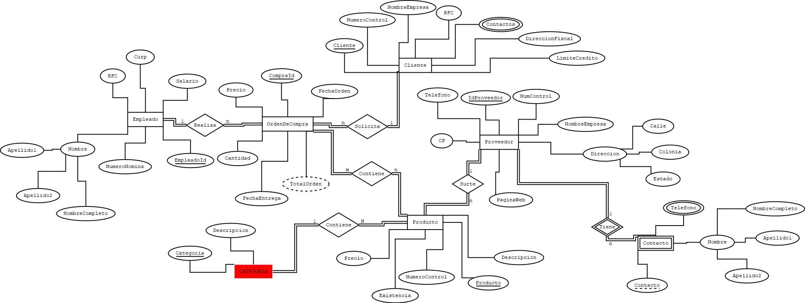
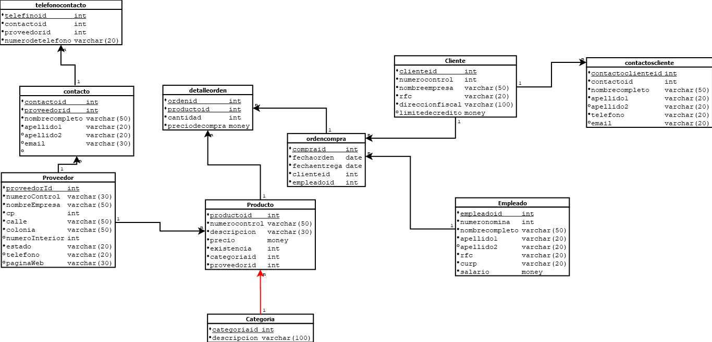

# Requerimientos
Una empresa encargada de las ventas de diferentes productos desea crear una base de datos que controles los proveedores, clientes, empleados, categorías de producto y ordenes de compra, para los proveedores se necesita almacenar un número de control, nombre de la empresa, dirección que consta de; dirección, numero, calle colonia y estado, código postal, teléfono, página web, teléfono de contacto o contactos del proveedor, nombre del contacto, numero del contacto, e-mail de contacto. Para los empleados se desea almacenar un numero de nómina, nombre completo del empleado, rfc, curp y salario (el salario no puede ser negativo, máximo de 65,000), para las órdenes de compra se necesita almacenar la fecha de creación y la orden, el empleado que la realizo, al cliente que se le vende, la fecha de entrega, y los diferentes productos que contiene. El producto debe almacenar un número de control, una descripción única, la existencia, y un precio. La categoría debe tener un identificador y nombre único de categoría. La compra siempre debe tener un precio de venta que se obtiene del precio unitario del producto. Los clientes necesitan numero de control, nombre de la empresa, rfc, dirección fiscal, contacto, límite de crédito (máximo de 150,000 pesos).
# Diagrama Conceptual E-R

# Diagrama Conceptual Logico Relacional


# Diagrama Fisico con SQL-LDD
```sql
create database tiendadigital;
go

--cambiar de base de datos
use tiendadigital;
go

--crear la tabla proveedor
create table proveedor (
proveedorid int not null identity(1,1),
numcontrol varchar(30) not null,
nombreempresa varchar(50) not null,
cp int not null,
calle varchar(50) not null,
colonia varchar(50) not null,
numero int,
estado varchar(20) not null,
telefono varchar(20),
paginaweb varchar(30),
constraint pk_proveedor
primary key(proveedorid),
constraint unico_numcontrol
unique(numcontrol),
constraint unico_nombreempresa
unique (nombreempresa)
);
go


--crear tabla categoria
create table categoria(
categoriaid int not null,
descripcion varchar(100) not null,
constraint pk_categoria
primary key(categoriaid),
constraint unico_descripcion
unique(descripcion)
);
go

--crear tabla producto
create table producto(
productoid int not null identity(1,1),
numerocontrol varchar(30) not null,
descripcion varchar(100) not null,
precio money not null,
existencia int not null,
[status] int not null,
categoriaid int not null,
constraint pk_producto
primary key(productoid),
constraint unico_numerocontrol
unique(numerocontrol),
constraint unico_descripcion_producto
unique(descripcion),
constraint chk_precio
check(precio>0.0),
constraint chk_existencia
--check(existencia between 0 and 2000)
check(existencia>=1 and existencia<=2000),
constraint chk_status
--check([status]=0 or [status]=1)
check([status] in(0,1)),
constraint fk_producto_categoria
foreign key(categoriaid)
references categoria(categoriaid)
);
go
create database tiendadigital;
go

--cambiar de base de datos
use tiendadigital;
go

--crear la tabla proveedor
create table proveedor (
proveedorid int not null identity(1,1),
numcontrol varchar(30) not null,
nombreempresa varchar(50) not null,
cp int not null,
calle varchar(50) not null,
colonia varchar(50) not null,
numero int,
estado varchar(20) not null,
telefono varchar(20),
paginaweb varchar(30),
constraint pk_proveedor
primary key(proveedorid),
constraint unico_numcontrol
unique(numcontrol),
constraint unico_nombreempresa
unique (nombreempresa)
);
go


--crear tabla categoria
create table categoria(
categoriaid int not null,
descripcion varchar(100) not null,
constraint pk_categoria
primary key(categoriaid),
constraint unico_descripcion
unique(descripcion)
);
go

--crear tabla producto
create table producto(
productoid int not null identity(1,1),
numerocontrol varchar(30) not null,
descripcion varchar(100) not null,
precio money not null,
existencia int not null,
[status] int not null,
categoriaid int not null,
constraint pk_producto
primary key(productoid),
constraint unico_numerocontrol
unique(numerocontrol),
constraint unico_descripcion_producto
unique(descripcion),
constraint chk_precio
check(precio>0.0),
constraint chk_existencia
--check(existencia between 0 and 2000)
check(existencia>=1 and existencia<=2000),
constraint chk_status
--check([status]=0 or [status]=1)
check([status] in(0,1)),
constraint fk_producto_categoria
foreign key(categoriaid)
references categoria(categoriaid)
);
go

create table cliente(
clienteid int not null identity(1,1),
numerocontrol varchar(20) not null,
nombreEmpresa varchar(50) not null default 'Mostrador',
rfc varchar(20) not null,
direccionfiscal varchar(100) not null,
limiteCredito money,
constraint pk_cliente
primary key(clienteid),
constraint unico_numerocontrol_cliente
unique(numerocontrol),
constraint unico_rfc_cliente
unique(rfc),
constraint chk_limite_credito
check(limiteCredito>=0 and limiteCredito<=100000)
);
go

create table empleado(
empleadoid int not null identity(1,1),
numeronomina int not null,
nombrecompleto varchar(50) not null,
apellido1 varchar(20) not null,
apellido2 varchar(20),
rfc varchar(20) not null,
curp varchar(20) not null,
salario money not null,
constraint pk_empleado
primary key(empleadoid),
constraint unico_numeronomina_empleado
unique(numeronomina),
constraint unico_rfc
unique(rfc),
constraint chk_salario
check(salario>0.0)
);
go

```
# Llenado de BD con SQL-LMD

# Consultas Simples
